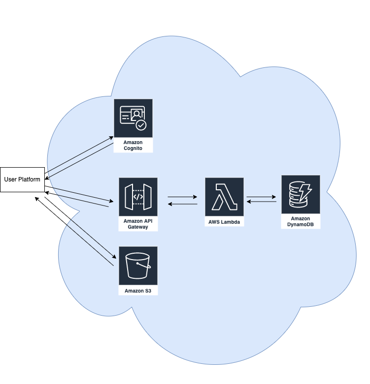

# SocialTech 

## Project Description
### Background
Homelessness has been a serious growing problem in the United States due to a growing shortage of affordable rental housing and increase in the cost of living. According to a report released by the U.S. Department of Housing and Urban Development (HUD), Washington State experienced a 6.2% increase in homelessness between 2019-2020, during which time 30 out of every 10,000 people in the state were homeless. The 2020 Point-in-Time count for Seattle/King County found 11,751 people experiencing homelessness on one night in January, with 53% sheltered and 47% unsheltered. It is important to care about the unsheltered homeless as it could often lead to isolation, a higher risk of mental illness, and physical vulnerability such as hate crime and disease. 
### Problem Statement
How might Individuals in need of shelter gain better access to shelter information so that they can make better-informed decisions about the condition and risk before arriving?

### Propsed solution
rWe aim to create platform that provides information on shelter to help individuals to find shelters that meets their need and concern. From our research, we learned that one bad experience or rumors on shelters make people hesitant to visit shelter for both new and experienced homeless. Therefore, creating an environment where everyone is welcomed to freely talk about their experience on shelters could reduce one’s concern/ fear on making visits on shelters

### Technical Description
#### Potential Architecture (might change in the future)

### User Stories
| Priority | User | Description |
| ----------- | ----------- | ----------- |
P0 | As a user |I want to be able to register and edit the settings in my profile |
P0 | As a user |I want to post free meal/shelter event specifying the time, location, and purpose of the event |
P0 | As a user |upvote or downvote based on the personal experience I had on the event that is posited |
P0 | As a user |upvote or downvote to alert other users if the details of the post is accurate such as date, time, location |
P0 | As a user |I can write comment to discuss about details of the event with others |
P0 | As a user |I can filter the posted events by past, current and future event |

### Endpoints
Coming soon...

### Data Models
Coming soon...

### Team Collaboation Rules
- create code review before pushing the code 
- work on local/seperate branch and later merge to main once code review is approved
- write clear comments on each commit to track workflow easier
