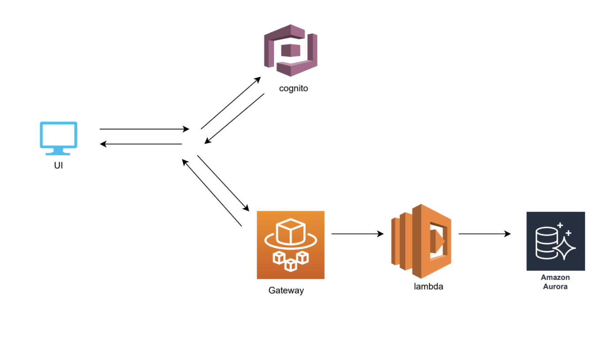

# SocialTech 

## Project Description
### Background
- According to a report released by the U.S. Department of Housing and Urban Development (HUD), Washington State experienced a 6.2% increase in homelessness between 2019-2020, during which time 30 out of every 10,000 people in the state were homeless
- The 2020 Point-in-Time count for Seattle/King County found 11,751 people experiencing homelessness on one night in January, with 53 percent sheltered and 47 percent unsheltered
Despite higher government spending such as $160 million to address housing and homelessness in 2020 to address homelessness did not reduce the number of homeless both federal and state level
- Due to COVID-19, high number of free meal and shelter providing organizations temporarily closed and have very frequent changes in their operation hours making individuals harder to attend the event
- Difficult for individuals to keep up with events as they need to visit each organization's web page or have to find static government document that includes local community events that are often outdated

### Propsed solution
real-time mobile/mobile friendly web app that will simplify the process of gathering information that serves as a single source of truth for free meal/shelter events by allowing both participants and organizer to advertise and share events

### Technical Description
#### Potential Architecture (might change in the future)

